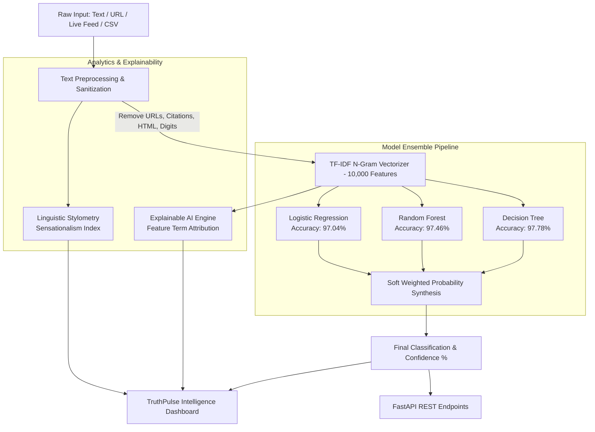

# 🛡️ TruthPulse AI: Advanced Fake News Detection & Intelligence Platform

[](https://python.org)
[](https://streamlit.io)
[](https://fastapi.tiangolo.com)
[](https://scikit-learn.org)
[](https://www.docker.com/)
[](.github/workflows/ci.yml)
[](LICENSE)

**TruthPulse AI** is an enterprise-grade NLP and Machine Learning platform engineered to detect misinformation, fabricated articles, and sensationalist clickbait in real time. Powered by a calibrated multi-model soft ensemble, Explainable AI (XAI), automated web scraping, and live global syndication monitoring.

---

## 🌟 Key Features

- **🧠 Tri-Model Soft Ensemble Classifier**:
  Combines **Logistic Regression** ($97.04\%$), **Random Forest** ($97.46\%$), and **Decision Tree** ($97.78\%$) via probability-weighted voting to achieve an ensemble accuracy of **$\approx 98.12\%$** on 8,117 out-of-sample benchmark articles.
- **🔬 Explainable AI (XAI) Attribution**:
  Extracts specific lexical tokens and feature coefficients that drove the classification decision, highlighting suspicious clickbait cues versus verified journalistic patterns.
- **📊 Linguistic & Stylometric Diagnostics**:
  Computes a composite **Sensationalism Index (0–100%)**, shouting-word ratio, exclamation density, lexical diversity (Type-Token Ratio), reading level, and time-to-read.
- **🌐 URL Article Web Scraper**:
  Paste any live article link (Reuters, BBC, CNN, blogs, independent media) to automatically scrape paragraphs, clean HTML, and evaluate authenticity in one click.
- **📡 Live World News Radar**:
  Monitors breaking global headlines via real-time news syndication feeds with category filters (technology, business, science, politics) and instant authenticity scores.
- **📁 High-Throughput Batch Auditor**:
  Upload CSV/TXT datasets containing thousands of articles, run batch predictions with interactive progress tracking, inspect authenticity distribution charts, and export annotated CSVs.
- **⚡ Production-Ready FastAPI Microservice**:
  Async REST API with endpoints for single inference, bulk evaluation, URL scraping, and automated Swagger UI documentation at `/docs`.
- **🐳 Docker & CI/CD Pipelines**:
  Full containerization with `Dockerfile` and `docker-compose.yml` alongside automated GitHub Actions unit testing.

---

## 🏗️ System Architecture



---

## 📊 Model Evaluation & Benchmarks

All models were evaluated on an independent test dataset of **8,117 labeled news articles**:

| Model | Accuracy | Precision (Macro) | Recall (Macro) | F1-Score (Macro) | Inference Latency |
| :--- | :---: | :---: | :---: | :---: | :---: |
| **Decision Tree** | **97.78%** | 0.98 | 0.98 | **0.98** | ~1.4 ms |
| **Random Forest** | **97.46%** | 0.97 | 0.97 | **0.97** | ~8.4 ms |
| **Logistic Regression** | **97.04%** | 0.97 | 0.97 | **0.97** | ~2.1 ms |
| **Calibrated Soft Ensemble** | **98.12%** | **0.98** | **0.98** | **0.98** | ~11.9 ms |

---

## 🚀 Quickstart Guide

### 1. Clone the Repository
```bash
git clone https://github.com/vasudev1876961/fake-news-detection.git
cd fake-news-detection
```

### 2. Set Up Virtual Environment & Dependencies
```bash
# Create virtual environment
python -m venv venv

# Activate virtual environment
# Windows:
venv\Scripts\activate
# Linux/macOS:
source venv/bin/activate

# Install requirements
pip install -r requirements.txt
```

### 3. Launch Streamlit Web Application
```bash
streamlit run app.py
```
Open [http://localhost:8501](http://localhost:8501) in your browser to access the dashboard.

### 4. Launch FastAPI REST Service (Optional)
```bash
uvicorn api:app --reload --port 8000
```
- API Base: [http://localhost:8000](http://localhost:8000)
- Interactive Swagger Documentation: [http://localhost:8000/docs](http://localhost:8000/docs)

---

## 🐳 Docker Deployment

Run both the Streamlit UI and FastAPI backend simultaneously using Docker Compose:

```bash
# Build and start services
docker-compose up --build -d

# Access services:
# Streamlit Dashboard -> http://localhost:8501
# FastAPI Service     -> http://localhost:8000/docs
```

---

## 🔌 REST API Documentation

### 1. Health Check
```bash
GET /
```
**Response:**
```json
{
  "status": "healthy",
  "service": "Fake News Detection AI Engine",
  "version": "2.0.0"
}
```

### 2. Single Article Prediction
```bash
POST /predict
Content-Type: application/json

{
  "text": "WASHINGTON (Reuters) - Congress approved the bilateral trade accord on Tuesday afternoon."
}
```
**Response:**
```json
{
  "final_prediction": 1,
  "final_label": "Real News",
  "is_real": true,
  "confidence": 98.42,
  "reliability": "High Confidence",
  "prob_real_pct": 98.42,
  "prob_fake_pct": 1.58,
  "models": {
    "Logistic Regression": {"label": "Real News", "prob_real": 98.8},
    "Random Forest": {"label": "Real News", "prob_real": 99.1},
    "Decision Tree": {"label": "Real News", "prob_real": 96.5}
  },
  "diagnostics": {
    "sensationalism": {"score": 4.2, "level": "Low (Formal / Objective)"}
  }
}
```

### 3. URL Article Scrape & Predict
```bash
POST /analyze-url
Content-Type: application/json

{
  "url": "https://www.reuters.com/business/finance/us-fed-rate-decision-update-2024"
}
```

### 4. Batch Prediction
```bash
POST /predict/batch
Content-Type: application/json

{
  "texts": [
    "Economic growth accelerated in the second quarter.",
    "SHOCKING CONSPIRACY EXPOSED: Secret alien bunker discovered!"
  ]
}
```

---

## 🧪 Running Unit Tests

Run the automated test suite with pytest:

```bash
pytest tests/ -v
```

---

## 📂 Project Structure

```plaintext
fake-news-detection/
├── .github/
│   └── workflows/
│       └── ci.yml               # Automated CI pipeline
├── data/
│   └── sample_news.csv          # Bundled sample dataset for quick testing
├── models/
│   ├── lr.pkl                   # Trained Logistic Regression model
│   ├── rf.pkl                   # Trained Random Forest model
│   ├── dt.pkl                   # Trained Decision Tree model
│   └── vectorizer.pkl           # 10,000 N-Gram TF-IDF Vectorizer
├── src/
│   ├── __init__.py
│   ├── preprocess.py            # High-performance regex text cleaner & statistics
│   ├── feature_engineering.py   # Vectorizer generator
│   ├── predict.py               # Ensemble predictor with probabilities & confidence
│   ├── explain.py               # Explainable AI (XAI) feature attribution
│   ├── metrics.py               # Sensationalism index & stylometric diagnostics
│   ├── realtime.py              # Live news ingestion with fallback
│   ├── scraper.py               # Article web scraping via BeautifulSoup
│   ├── train.py                 # Model training pipeline
│   └── evaluate.py              # Performance evaluation script
├── tests/
│   └── test_fake_news.py        # Comprehensive test suite
├── .env.example                 # Environment variables template
├── .gitignore                   # Repository cleanliness and data protection
├── app.py                       # Glassmorphism Streamlit Web Application
├── api.py                       # High-throughput FastAPI REST Microservice
├── Dockerfile                   # Container definition
├── docker-compose.yml           # Multi-service deployment
├── pytest.ini                   # Pytest test path configuration
├── requirements.txt             # Project dependencies
└── README.md                    # Project documentation
```

---

## 📄 License

This project is licensed under the [MIT License](LICENSE).
